# 🏠 Scorpion Estate – Modern Real Estate Marketplace

A fully responsive **Real Estate Marketplace** built using the **MERN Stack** (MongoDB, Express.js, React, Node.js) with features like JWT authentication, Google authentication (Firebase), Redux Toolkit for state management, and a modern UI.

🌐 **Live Demo**: [scorpion-estate.onrender.com/](https://scorpion-estate.onrender.com/)

## 🚀 Features

- 🔐 **JWT Authentication** – Secure user authentication and authorization.
- 🔑 **Google Authentication** – Sign in with Google using Firebase.
- 🏡 **Create & Manage Listings** – Users can create, update, and delete property listings.
- 🔍 **Advanced Search** – Filter properties by location, price, and features.
- 📱 **Fully Responsive** – Works seamlessly across all devices.
- 🛠️ **Redux Toolkit** – Efficient state management for a smooth user experience.
- 📸 **Image Uploads** – Upload multiple images for property listings.
- 👤 **User Profiles** – Personalized profiles for users to manage their listings and preferences.

## 🛠️ Tech Stack

- **Frontend**: React, Redux Toolkit, Tailwind CSS
- **Backend**: Node.js, Express.js
- **Database**: MongoDB
- **Authentication**: JWT (JSON Web Tokens), Firebase (Google Authentication)
- **Deployment**: Render

## 📷 Screenshots

### Home Page
| Home Page 1 | Home Page 2 | Home Page 3 | Home Page 4 | Home Page 5 |
|-------------|-------------|-------------|-------------|-------------|
|  | 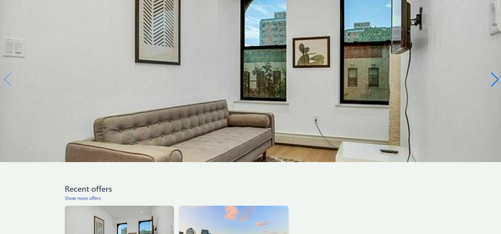 | 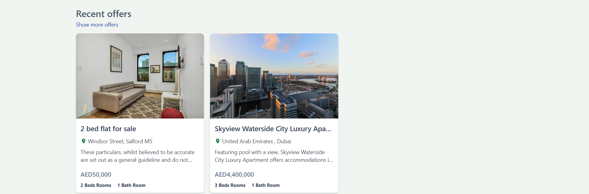 |  |  |

### Post Details Page
| Post Details 1 | Post Details 2 | Post Details 3 | Post Details 4 |
|----------------|----------------|----------------|----------------|
| 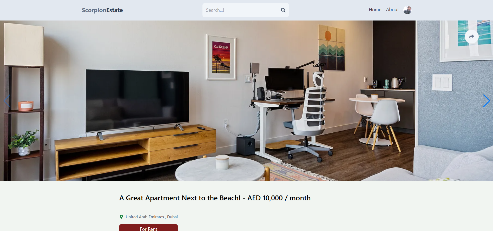 | 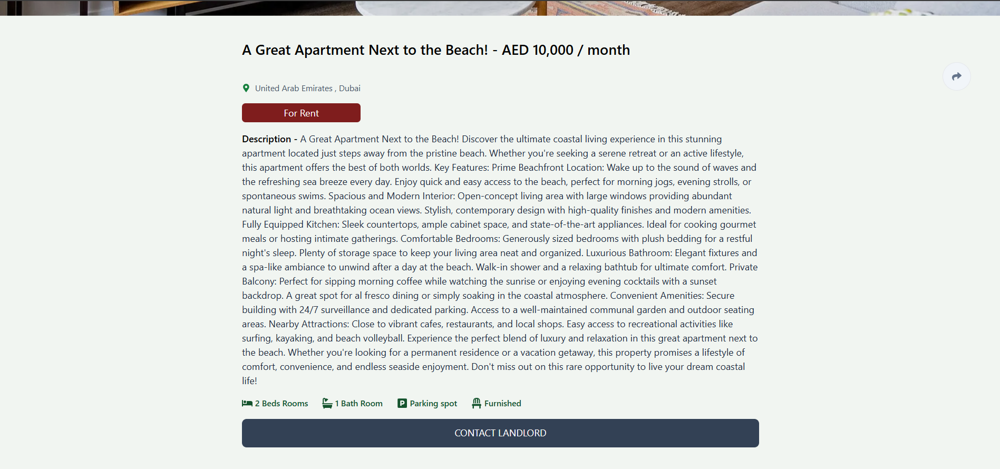 | 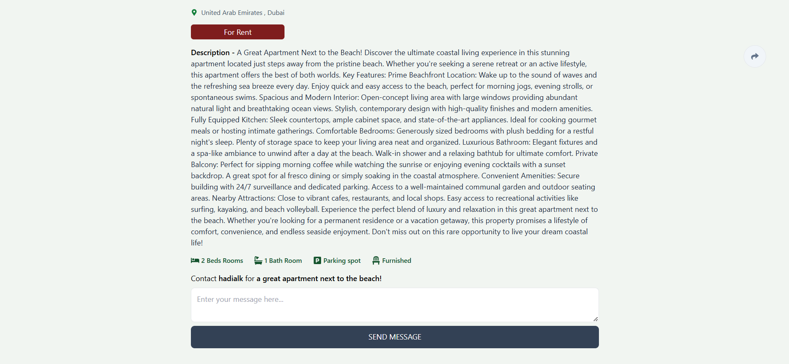 | 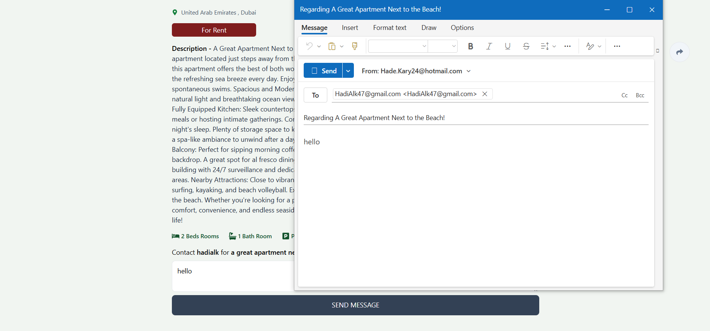 |

### About Page
| About Page |
|------------|
| 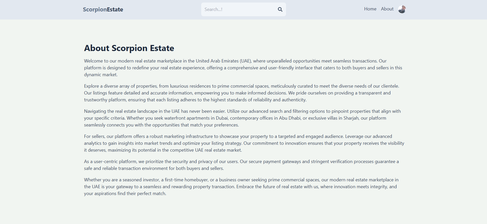 |

### Profile Page
| Profile Page |
|--------------|
| 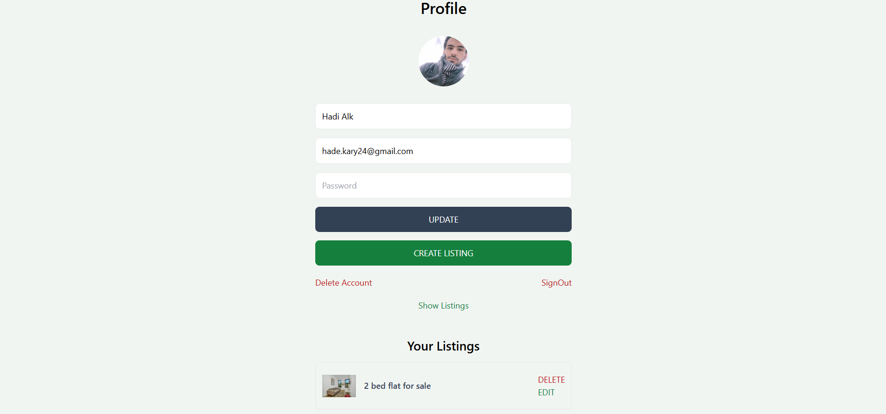 |

### Edit Post Page
| Edit Post Page |
|----------------|
| 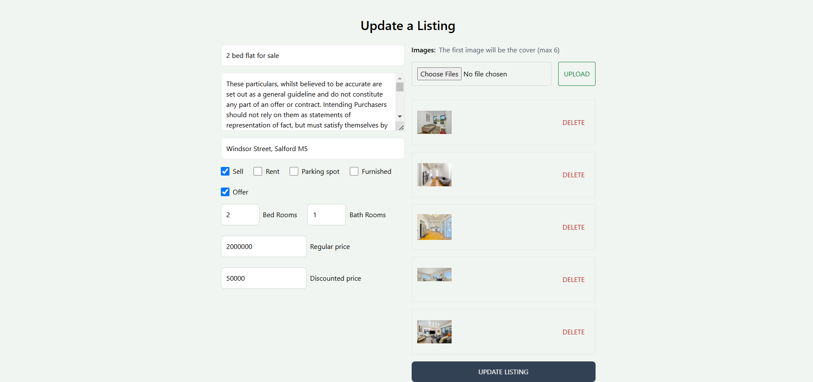 |

### Create Post Page
| Create Post Page |
|------------------|
| 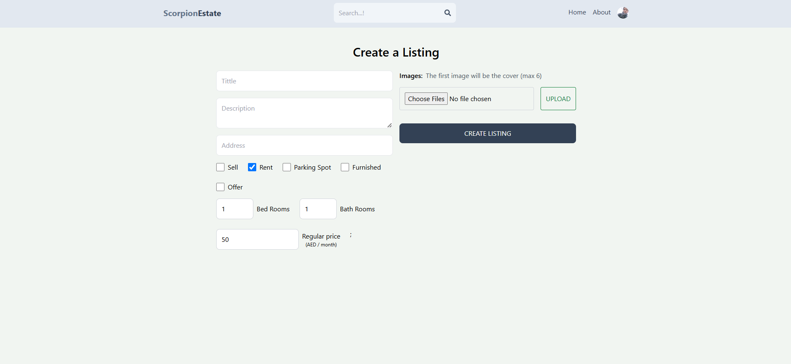 |

### Search Page
| Search Page 1 | Search Page 2 |
|---------------|---------------|
| 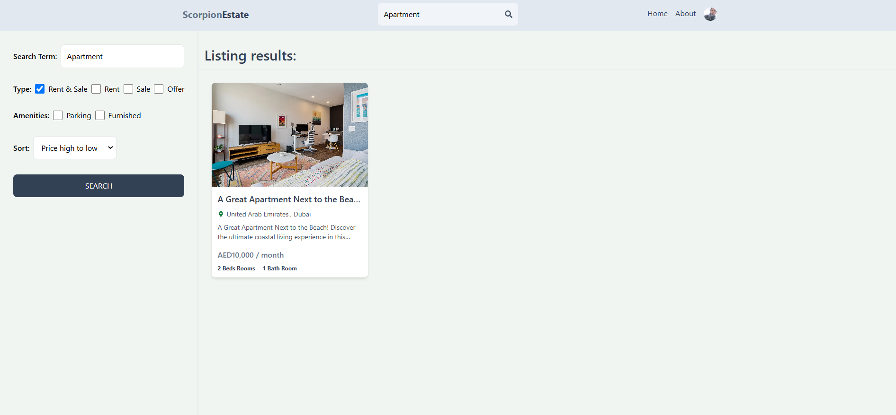 | 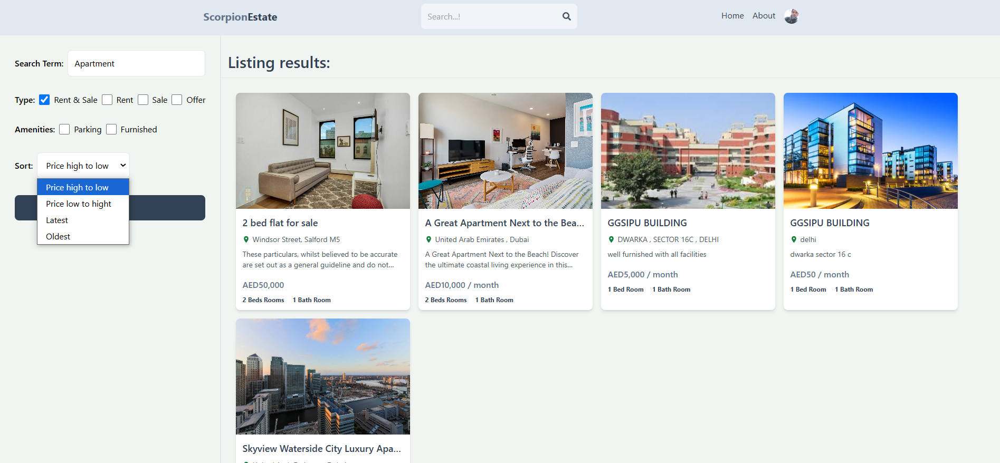 |

### Authentication Page
| Login Page | Signup Page |
|------------|-------------|
| 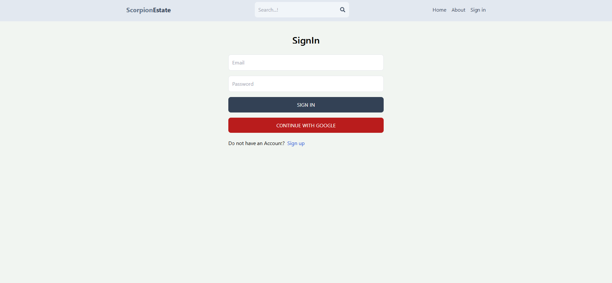 | 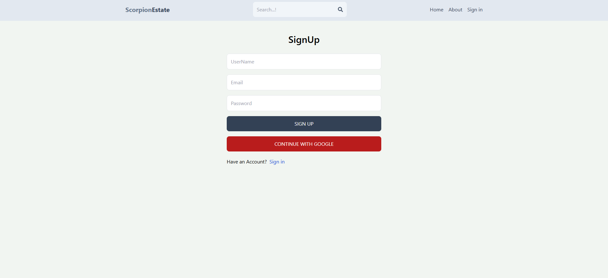 |

# Scorpion Estate

## 🎯 How to Use

1. **Clone the Repository**  
   ```bash
   git clone https://github.com/hadialkari/MERN-Estate.git
   cd scorpion-estate
   ```

2. **Install Dependencies**  

   For the client (frontend):
   ```bash
   cd client
   npm install
   ```

   For the server (backend):
   ```bash
   cd api
   npm install
   ```

3. **Set Up Environment Variables**  

   Create a `.env` file in the `api` directory and add the following:

   ```env
   MONGO_URI=your_mongodb_connection_string
   JWT_SECRET=your_jwt_secret_key
   ```

     Create a `.env` file in the `client` directory and add the following:

   ```env
   VITE_FIREBASE_API_KEY = 'your_VITE_FIREBASE_API_KEY'
   ```

4. **Run the Application**  

   Start the backend server:
   ```bash
   cd api
   npm run dev
   ```

   Start the frontend development server:
   ```bash
   cd client
   npm run dev
   ```

5. **Open the Application**  
   Visit [http://localhost:5173/](http://localhost:5173/) in your browser.

## 🔑 Google Authentication Setup

To enable Google authentication:

1. Go to the Firebase Console.
2. Create a new project and set up authentication using Google.
3. Add your web app to the Firebase project and copy the Firebase configuration.

## 📜 License

This project is **open-source**
